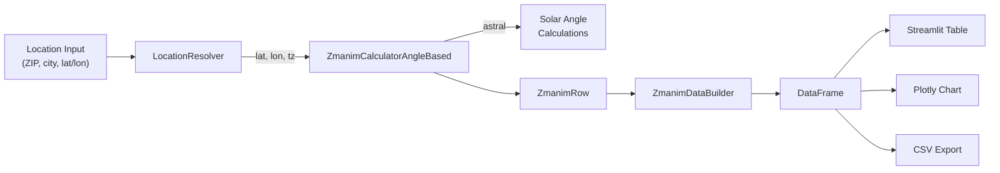

# Zmanim Tracker

A Jewish prayer times (zmanim) calculator and tracker that computes halachic prayer times for any location worldwide. Uses solar angle calculations to derive times like alos hashachar, misheyakir, sunrise, latest shema, latest shacharit, chatzos, mincha gedolah, mincha ketana, plag hamincha, sunset, tzais, and chatzot halaila.

## What Are Zmanim?

Zmanim (Hebrew: times) are the halachically-defined times of day that govern Jewish prayer and observance. Unlike fixed clock times, most zmanim are calculated based on the sun's position relative to the horizon at a specific location and date. The length of a "halachic hour" (shaah zmanis) varies with the seasons — longer in summer, shorter in winter.

## Architecture



## Features

- Compute all standard zmanim for any date range at any location
- Three location input methods: latitude/longitude, US ZIP code, or free-text search
- Automatic timezone detection from coordinates
- Interactive Plotly chart showing zmanim curves over time
- Today's zmanim highlighted in a summary view
- Shabbat candle lighting and havdalah times
- CSV export for offline use
- Configurable depression angles for angle-based zmanim
- GRA opinion for time-based zmanim (shaah zmanis = daylight / 12)

## Supported Zmanim

| Zman | Method | Description |
|------|--------|-------------|
| Alos HaShachar (astronomical) | 16.9 deg depression | Earliest dawn |
| Alos HaShachar (nautical) | 12.0 deg depression | Standard dawn |
| Misheyakir | 10.0 deg depression | Earliest tallit and tefillin |
| Sunrise | Solar calculation | Hanetz hachama |
| Latest Shema | sunrise + 3 shaos | End of time for Shema (GRA) |
| Latest Shacharit | sunrise + 4 shaos | End of time for Shacharit (GRA) |
| Chatzos | Solar noon | Halachic midday |
| Mincha Gedolah | sunrise + 6.5 shaos | Earliest Mincha |
| Mincha Ketana | sunrise + 9.5 shaos | Preferred Mincha time |
| Plag HaMincha | sunrise + 10.75 shaos | Boundary between Mincha and Maariv |
| Sunset | Solar calculation | Shkiah |
| Tzais (three stars) | 8.5 deg depression | Nightfall — three medium stars visible |
| Tzais (civil) | 6.0 deg depression | Civil twilight end |
| Chatzot HaLaila | Midpoint sunset..sunrise | Halachic midnight |
| Candle Lighting | sunset - 18 min | Friday only (configurable offset) |
| Havdalah | tzais three stars | Saturday only |

## Location Input Methods

1. **Latitude/Longitude** — Enter coordinates directly (e.g., `40.7128, -74.0060`)
2. **US ZIP Code** — Enter a 5-digit ZIP (e.g., `10001`). Resolved via pgeocode (offline)
3. **Free-text** — Enter a city, address, or place name (e.g., `Jerusalem, Israel`). Resolved via OpenStreetMap Nominatim

## How to Run

### With Docker (recommended)

```bash
# macOS/Linux
./run_zmanim_tracker.sh

# Windows
run_zmanim_tracker.bat
```

The launcher builds the Docker container, starts the service, and opens the browser. Use the interactive menu to restart or stop:
- `r` — full restart (rebuild and relaunch)
- `k` — stop, keep Docker image
- `q` — stop, remove Docker image
- `v` — stop, remove image and volumes

### Without Docker

```bash
# Install dependencies
uv sync

# Run the app
uv run streamlit run zmanim_tracker.py
```

The app runs at `http://localhost:8501` by default. Override with the `ZT_PORT` environment variable.

## Configuration

All calculator parameters are configurable via the `ZmanimCalculatorAngleBased` constructor:

| Parameter | Default | Description |
|-----------|---------|-------------|
| `alos_astronomical_edge_deg` | 16.9 | Depression angle for earliest alos |
| `alos_nautical_edge_deg` | 12.0 | Depression angle for nautical alos |
| `misheyakir_deg` | 10.0 | Depression angle for misheyakir |
| `tzais_three_stars_deg` | 8.5 | Depression angle for nightfall |
| `tzais_civil_end_deg` | 6.0 | Depression angle for civil twilight |
| `candle_lighting_offset_min` | 18 | Minutes before sunset for candle lighting |
| `shabbat_end_offset_min` | 0 | Additional minutes after tzais for havdalah |

## Project Phases

| Phase | Description | Status |
|-------|-------------|--------|
| 1 | Streamlit app with full zmanim calculation | In progress |
| 2 | FastAPI backend + React frontend + Hebrew calendar | Planned |
| 3 | Notifications, calendar sync, PDF generation | Planned |

## Tech Stack

- **Python 3.13+** with full type annotations
- **Streamlit** for the web UI (Phase 1)
- **astral** for solar angle calculations
- **pgeocode** for offline US ZIP code resolution
- **TimezoneFinder** for coordinate-to-timezone lookup
- **pandas** for tabular data handling
- **Plotly** for interactive charts
- **Docker** for containerized deployment
- **pytest** for testing (100% coverage target)
- **ruff** for linting and formatting