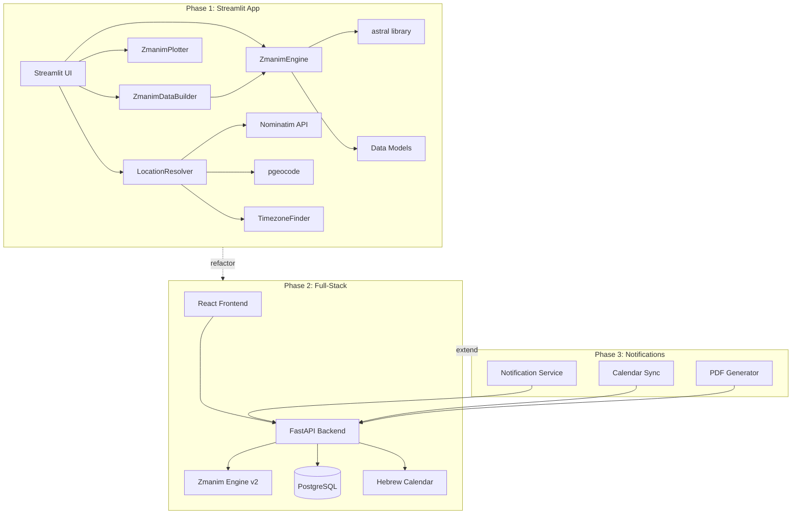
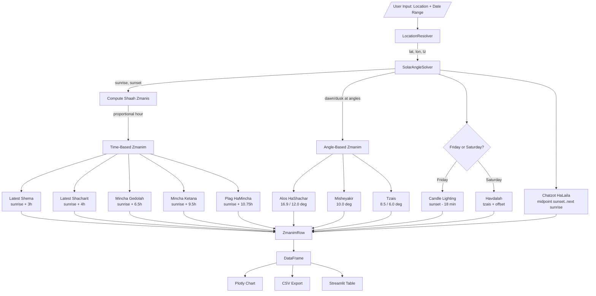
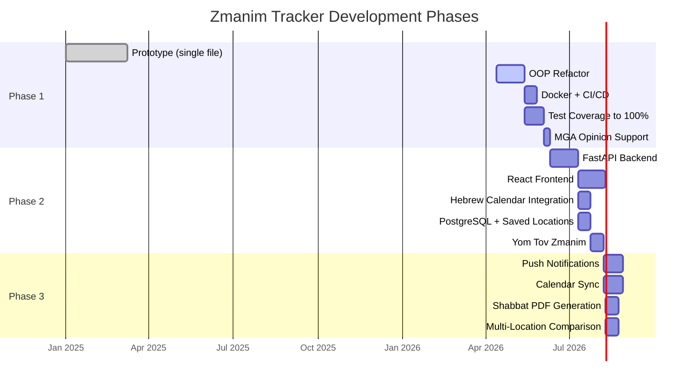

# Zmanim Tracker — Master Plan

## 1. Project Vision

A halachic prayer times calculator and tracker that computes accurate zmanim for any location worldwide. Built for a Torah-observant user who relies on these times for daily religious practice — accuracy is non-negotiable.

The project progresses through three phases: a local Streamlit app, a full-stack web application, and a notification/calendar integration platform.

---

## 2. Architecture Overview

## 3. Calculation Flow

## 4. Phase Roadmap

---

## 5. Phase 1 — Streamlit App

### 5.1 Goals
- Accurate zmanim calculation for any location worldwide
- Multiple location input methods (lat/lon, ZIP, free-text)
- Date range support with tabular and chart output
- CSV export
- Shabbat candle lighting and havdalah times
- Docker containerized
- 100% test coverage

### 5.2 Deliverables
1. OOP-refactored codebase (one class per file)
2. Full test suite validating against reference zmanim sources
3. Docker + docker-compose setup
4. CI/CD pipeline (GitLab)
5. MGA opinion support (in addition to GRA)

### 5.3 Phase 1 Completion Gate
- [ ] All classes in separate files under `src/`
- [ ] `from __future__ import annotations` in every module
- [ ] Full type annotations, ruff clean
- [ ] pytest coverage at 100%
- [ ] At least 3 reference-validated test cases (different locations, seasons)
- [ ] Docker builds and runs cleanly
- [ ] CI pipeline passes (lint, test, coverage, build, docker-build)
- [ ] GRA and MGA opinions both supported
- [ ] `docs/status.md` and `docs/versions.md` current
- [ ] Launcher scripts work on macOS and Windows

---

## 6. Phase 2 — Full-Stack Web Application

### 6.1 Goals
- FastAPI backend serving zmanim via REST
- React + TypeScript frontend with interactive UI
- Hebrew calendar integration for parsha, yom tov awareness
- PostgreSQL for user preferences and saved locations
- Yom tov-aware candle lighting and havdalah

### 6.2 Key Decisions
- Backend reuses the same engine classes from Phase 1
- Frontend uses Chart.js for zmanim visualization (matching charting preferences)
- Hebrew calendar via `hdate` or `jewish-calendar` Python library
- Authentication: session-based (FastAPI + PostgreSQL)

### 6.3 Phase 2 Completion Gate
- [ ] FastAPI serves all zmanim via REST endpoints
- [ ] React frontend renders zmanim with interactive charts
- [ ] Hebrew date displayed alongside Gregorian
- [ ] Yom tov candle lighting and havdalah correct for all major holidays
- [ ] Saved locations persist in PostgreSQL
- [ ] Backend + frontend Docker containers orchestrated
- [ ] API documented via OpenAPI/Swagger

---

## 7. Phase 3 — Notifications & Calendar Integration

### 7.1 Goals
- Push notifications N minutes before configurable zmanim
- Google Calendar / Apple Calendar .ics export
- Weekly Shabbat schedule PDF
- Side-by-side comparison of zmanim at multiple locations

### 7.2 Phase 3 Completion Gate
- [ ] Notifications delivered reliably
- [ ] Calendar events created correctly
- [ ] PDF renders all Shabbat times with correct Hebrew dates
- [ ] Multi-location view functional

---

## 8. Cross-Phase Concerns

### 8.1 Halachic Opinions (Shitot)
The engine must support multiple halachic opinions. Phase 1 implements GRA; Phase 1 extension adds MGA. Future phases may add:
- Rabbeinu Tam (72-minute sunset)
- Yereim (dawn-to-dawn day definition)
- Various community minhagim for candle lighting offsets

Each opinion is a configuration of the calculator, not a separate engine.

### 8.2 Canonical Unit System
- **Angles:** decimal degrees (the `astral` library convention)
- **Time:** Python `datetime` with timezone-aware objects (always `ZoneInfo`)
- **Duration:** Python `timedelta`
- **Coordinates:** decimal degrees (WGS84)

### 8.3 External API Dependencies
| Service | Purpose | Rate Limit |
|---------|---------|------------|
| Nominatim (OpenStreetMap) | Free-text geocoding | 1 req/sec max |
| pgeocode | US ZIP → lat/lon | Local (no network) |
| TimezoneFinder | lat/lon → IANA tz | Local (no network) |
| astral | Solar calculations | Local (no network) |

### 8.4 Data Flow Contracts
- `LocationResolver.resolve(str) -> Location` — never returns None; raises ValueError on failure
- `ZmanimCalculatorAngleBased.compute_for_day(Location, date) -> ZmanimRow` — never returns None; raises on polar regions where sun doesn't set/rise
- `ZmanimDataBuilder.build(Location, date, date) -> pd.DataFrame` — empty DataFrame if end < start (after validation error)

---

## 9. Technology Choices

| Tool | Why |
|------|-----|
| **astral** | Pure Python solar calculations, well-maintained, handles refraction |
| **pgeocode** | Offline ZIP code resolution, no API dependency |
| **TimezoneFinder** | Offline timezone lookup from coordinates |
| **Streamlit** | Rapid UI for Phase 1; replaced by React in Phase 2 |
| **Plotly** | Interactive charts in Streamlit (Phase 1 only) |
| **pandas** | DataFrame output for tabular display and CSV export |
| **requests** | Nominatim geocoding HTTP calls (will migrate to httpx in Phase 2) |
| **ruff** | Lint + format, replaces black/flake8/isort |
| **pytest** | Testing framework with coverage |
| **Docker** | Containerized deployment |
| **uv** | Python package manager |